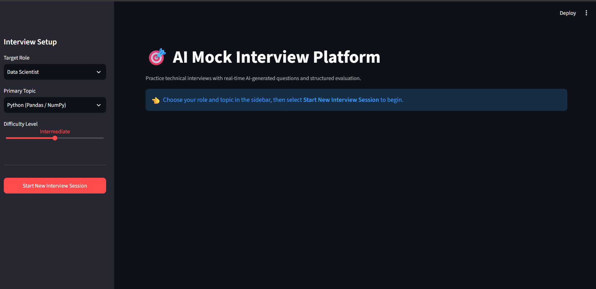
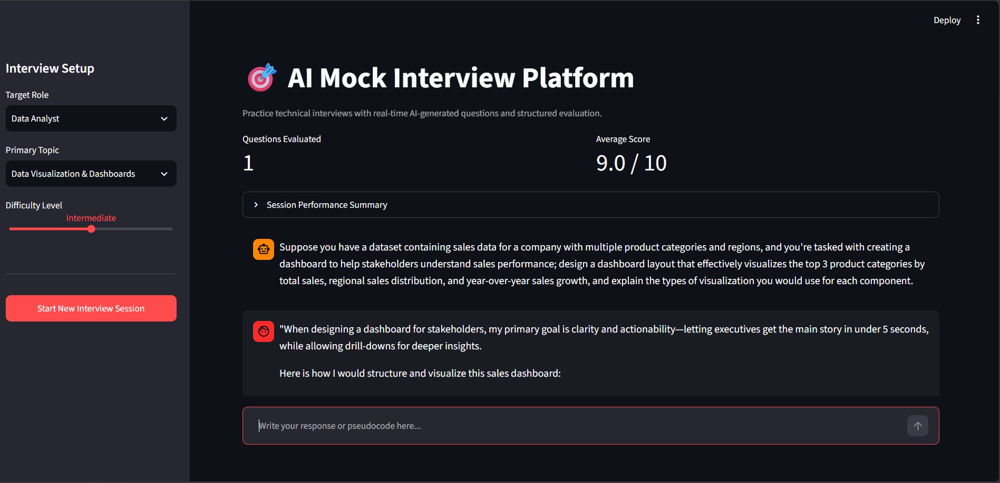

# 🎯 AI-Powered Mock Interview Platform

An interactive, AI-driven mock technical interview platform built with **Streamlit**, **Groq LLMs (Llama 3.3 70B)**, and **Pydantic**. This app dynamically generates technical questions tailored to specific engineering roles and topics, provides real-time structured evaluation, and tracks candidate performance.

---

## 🌟 Key Features

* **Role & Topic Specialization:** Dynamically maps technical topics based on selected target roles (*Data Scientist, ML Engineer, Backend Developer, Data Analyst, Full Stack Developer*).
* **Adaptive Question Generation:** Powered by Groq's fast inference engine (`llama-3.3-70b-versatile`) to generate realistic questions tailored to selected difficulty levels (*Beginner, Intermediate, Advanced*).
* **Structured AI Feedback:** Evaluates answers with numerical scoring (0–10), technical accuracy summaries, highlighted strengths, and missing concepts.
* **Performance Analytics:** Tracks average candidate performance across questions and renders a session history summary table.
* **Streamlined UI/UX:** Clean chat interface built with Streamlit's native components and state management.

---


## 📸 Screenshots

| 1. Landing Page & Sidebar Setup | 2. Active Interview Session & Metrics |
| :---: | :---: |
|  |  |

---

## 🛠️ Tech Stack

* **Frontend / UI:** [Streamlit](https://streamlit.io/)
* **LLM Engine:** [Groq API](https://groq.com/) (`llama-3.3-70b-versatile`)
* **Data Validation:** [Pydantic](https://docs.pydantic.dev/)
* **Environment & Config:** `python-dotenv`
* **Data Processing:** Pandas

---

## 📂 Project Structure

```text
ai-mock-interview/
├── assets/                  # Screenshots and media assets
├── .env                     # Local environment variables (API keys - Git ignored)
├── .gitignore               # Git ignore rules
├── app.py                   # Main Streamlit application UI & session management
├── interviewer.py           # Core Interview Engine & Groq LLM integration
├── requirements.txt         # Project dependencies
└── README.md                # Project documentation
